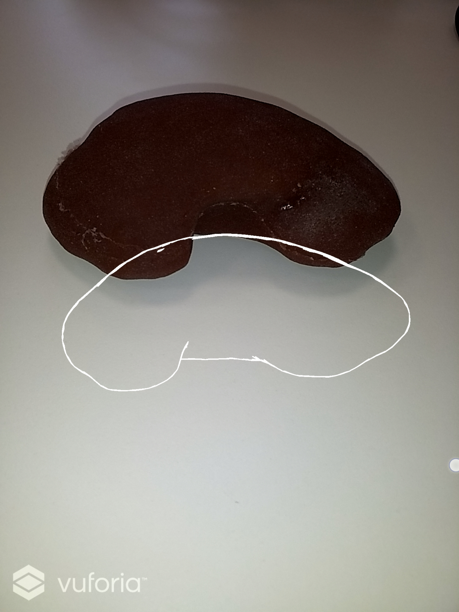
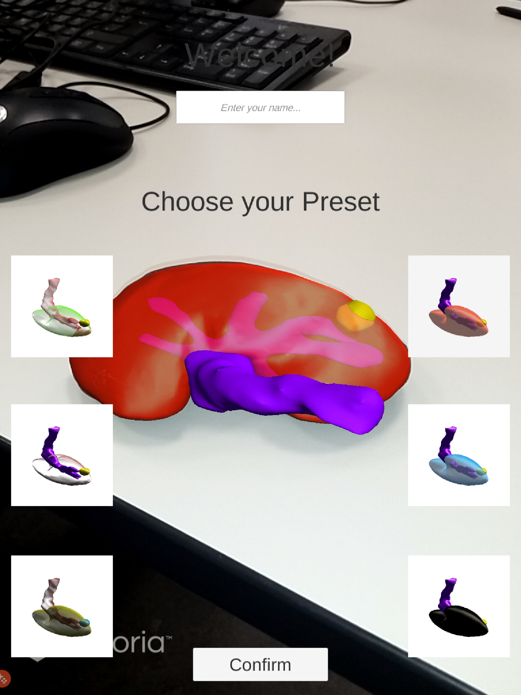

## Open Medical AR framework

Example augmentation for a patient kidney, from the OpenHELP phantom [1].
Tracking is done by training a multi-view model of the target organ (i.e. kidney) using Vuforia. The relevant geometry is given as STL files: kidney, tumor, calyx.


## Dependencies

Simple installation with Unity Hub: https://unity3d.com/de/get-unity/download
+ Unity 2019.1.14f1 installation
+ Android Build Support + Android SDK
+ Vuforia Augmented Reality Support


## Usage

Deploy on Android device: 
1. Enable developer options on the Android device and connect it to the PC
2. Open the Unity Project with the right Unity version and all needed dependencies
3. Open the build settings in Unity under "File/Build Settings..."
4. If not selected, select Android as Platform and confirm with "Switch Platform"
5. Choose in the dropdown menu your connected Android device
6. Compile with "Build" or "Build and Run"
7. Accept the installation request on the Android device
8. The App should show up in your app drawer

Testing on PC:
1. Open the Unity Project with the right Unity version and all needed dependencies
2. Connect a webcam to your PC
3. Start debugging by clicking the play button in Unity

General usage:
1. Start the program on your Android device or PC
2. You can test with a 3D model or an image of the laparoscopy phantom kidney
3. Point the camera or device at the kidney until a white outline is visible
4. Move image/kidney or camera, that the kidney matches the ouline until the tracking starts and a 3D visualization is visible
5. Choose between the presets and select one with "Confirm"
6. Change the preset to your likings
7. Every change will be locally tracked in the "History.csv"

More technical informations and detailed button descriptions can be found in [this Presentation](KP_NCT_Final_Presentation.pdf).


| Image of 3D printed kidney | White outline | Start of tracking and visualization |
| --- | --- | --- |
|  |  |  |

[1] Kenngott, H. G.; Wunscher, J. J.; Wagner, M.; Preukschas, A.; Wekerle, A. L.; Neher, P. et al. (2015): OpenHELP (Heidelberg laparoscopy phantom): development of an open-source surgical evaluation and training tool. In Surgical endoscopy.


## LICENCE
```
The MIT License (MIT). C.f. LICENCE file for full licence.

Permission is hereby granted, free of charge, to any person obtaining a copy
of this software and associated documentation files (the "Software"), to deal
in the Software without restriction, including without limitation the rights
to use, copy, modify, merge, publish, distribute, sublicense, and/or sell
copies of the Software, and to permit persons to whom the Software is
furnished to do so, subject to the following conditions:

The above copyright notice and this permission notice shall be included in all
copies or substantial portions of the Software.

THE SOFTWARE IS PROVIDED "AS IS", WITHOUT WARRANTY OF ANY KIND, EXPRESS OR
IMPLIED, INCLUDING BUT NOT LIMITED TO THE WARRANTIES OF MERCHANTABILITY,
FITNESS FOR A PARTICULAR PURPOSE AND NONINFRINGEMENT. IN NO EVENT SHALL THE
AUTHORS OR COPYRIGHT HOLDERS BE LIABLE FOR ANY CLAIM, DAMAGES OR OTHER
LIABILITY, WHETHER IN AN ACTION OF CONTRACT, TORT OR OTHERWISE, ARISING FROM,
OUT OF OR IN CONNECTION WITH THE SOFTWARE OR THE USE OR OTHER DEALINGS IN THE
SOFTWARE. 
```
